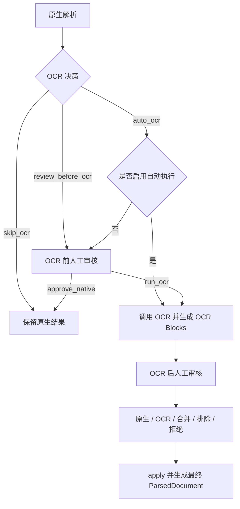

# Document Parser Pipeline

一个面向企业 RAG 数据工程的多格式文档解析流水线。它把 PDF、DOCX、XLSX、HTML、Markdown、PPTX 统一转换为可观测、可审核、可追溯的 `ParsedDocument`，供不同业务项目继续执行 Chunk 切分、Embedding 和检索入库。

## 项目边界

本项目只负责解析层：


本项目不包含 Chunk、Embedding、PostgreSQL、向量索引、全文检索、Rerank 和业务有效性审核。解析规则可以跨项目复用；切分与检索规则应由具体 RAG 项目管理。

## 核心能力

- 六种格式统一解析：PDF、Word、Excel、HTML、Markdown、PowerPoint。
- 统一 Block 模型：标题、段落、列表、表格、图片、图注、代码等。
- PDF 坐标排序、表格区域排除、跨页正文合并、同表头跨页表格合并。
- DOCX 正文顺序恢复，避免 `paragraphs` 与 `tables` 分开读取导致顺序错乱。
- XLSX 多 Sheet、单元格区域、表格和图片定位信息保留。
- HTML 主体内容提取和导航、脚本、页眉页脚噪声清理。
- OCR 分流：原生解析可用时跳过；扫描页自动候选；混合页和低质量表格进入人工审核。
- 结构审核与 OCR 审核均采用追加式决策，基础解析产物不会被直接覆盖。
- 每个阶段落盘，支持定位“解析器、清洗、修复还是审核”导致的问题。

## 项目目录

```text
rag-document-parser/
├── .github/
│   └── workflows/
│       └── tests.yml              # GitHub Actions：Python 3.10/3.12 自动测试
├── fixtures/                      # 六种格式的可公开回归样例
│   ├── pdf/
│   ├── docx/
│   ├── xlsx/
│   ├── html/
│   ├── markdown/
│   └── pptx/
├── migration/
│   └── baseline_manifest.json     # 从原项目抽取时固化的迁移基线
├── src/
│   └── document_parser/
│       ├── parsers/               # 各文件类型 Parser Adapter
│       ├── ocr/                   # OCR 决策、任务、Provider 和审核流程
│       ├── review/                # 跨页正文、表格等结构人工审核
│       ├── models.py              # Block、ParsedDocument 等统一数据模型
│       ├── pipeline.py            # 单文件解析主编排
│       ├── batch.py               # 目录批量解析和失败隔离
│       ├── cleaner.py             # 通用文本清洗
│       ├── repair.py              # 排序、章节和跨页结构修复
│       ├── evaluation.py          # 解析技术质量评测
│       ├── artifacts.py           # 解析当前最终有效产物
│       └── cli.py                 # document-parser 命令行入口
├── tests/                         # 单元、集成、回归和架构边界测试
├── .env.example                   # OCR 配置模板，不包含真实密钥
├── .gitignore
├── pyproject.toml                 # 包信息、依赖、CLI 和测试配置
└── README.md
```

运行生成的 `outputs/`、本地 `.env`、构建产物和缓存不会提交到 Git。项目采用 `src layout`：安装后导入的是 `src/document_parser` 中的 Python 包，而不是直接从仓库根目录导入源码。

## 主入口和模块关系

命令行入口：

```text
document-parser
    ↓ pyproject.toml [project.scripts]
document_parser.cli:main
    ↓
DocumentParsingPipeline / parse_directory / review workflow
```

Python 入口：

```python
from document_parser import DocumentParsingPipeline
from document_parser.batch import parse_directory
from document_parser.artifacts import resolve_parsing_artifacts
```

解析包只交付最终有效 `ParsedDocument`。下游项目应在人工审核完成后，再执行自己的 Chunk、Embedding、数据库和检索流程。

## 安装

要求 Python 3.10 及以上版本。

```powershell
cd D:\AoCodex\RAG-system\document-parser-pipeline
python -m pip install -e .
document-parser --help
```

`-e` 表示可编辑安装，适合本地开发。安装后可以使用 `document-parser` 命令；以下两种写法等价：

```powershell
document-parser --help
python -m document_parser --help
```

开发与测试：

```powershell
python -m pip install -e ".[dev]"
python -m pytest
```

Windows 终端显示中文乱码时，可先设置：

```powershell
$env:PYTHONIOENCODING="utf-8"
```

## 解析单个文件

```powershell
document-parser parse "D:\water_documents\policy\水价政策.pdf" `
  --output "D:\water_parse_outputs"
```

也可以传入来源和调用方 Metadata：

```powershell
document-parser parse "D:\water_documents\policy\水价政策.pdf" `
  --output "D:\water_parse_outputs" `
  --source-url "https://example.com/water-price.pdf" `
  --metadata-json '{"category":"water_price_policy","source_system":"knowledge_asset_center"}'
```

## 批量解析目录

假设源文件目录为：

```text
D:\water_documents\
├── policy\
│   ├── 水价政策.pdf
│   └── 违约金规定.html
├── service\
│   ├── 报装指南.docx
│   └── 营业网点.xlsx
├── faq.md
└── 运维培训.pptx
```

递归解析目录及其子目录：

```powershell
document-parser batch "D:\water_documents" `
  --output "D:\water_parse_outputs"
```

默认支持 `.pdf`、`.docx`、`.xlsx`、`.html/.htm`、`.md/.markdown`、`.pptx`。如不希望进入子目录，增加 `--no-recursive`。

每份源文件会创建一个独立运行目录，并生成总批次报告：

```text
D:\water_parse_outputs\
├── batch_report.json
├── 20260811_180001_水价政策_pdf\
├── 20260811_180003_报装指南_docx\
├── 20260811_180004_营业网点_xlsx\
└── _ocr_review\
```

`batch_report.json` 记录文件总数、成功数、待审核数、失败数，以及每份文档的 `document_id`、Block 数量和运行目录。批量处理单个文件失败时会记录错误并继续处理其他文件。

## 解析状态

单文件结果和批次报告中的状态含义：

| 状态 | 含义 | 后续动作 |
| --- | --- | --- |
| `finalized` | 技术解析检查通过 | 可交给业务准入和 Chunk 流程 |
| `review_required` | 存在 OCR、跨页合并或结构风险 | 完成人工审核后再使用最终版本 |
| `failed` | 存在阻断性解析错误 | 查看日志和评测文件 |

`finalized` 只表示解析技术质量通过，不表示文档来源、权限、版本、有效期和业务内容已经审核通过。

## Python API

单文件解析：

```python
from pathlib import Path

from document_parser import DocumentParsingPipeline

pipeline = DocumentParsingPipeline(Path("outputs/runs"))
result = pipeline.parse(
    Path("example.pdf"),
    metadata={"source_system": "knowledge_asset_center"},
    source_url="https://example.com/example.pdf",
)

print(result.status)
print(result.parsed_document.title)
print(len(result.parsed_document.blocks))
```

批量解析：

```python
from pathlib import Path

from document_parser import DocumentParsingPipeline
from document_parser.batch import parse_directory

pipeline = DocumentParsingPipeline(Path(r"D:\water_parse_outputs"))
report = parse_directory(
    pipeline,
    Path(r"D:\water_documents"),
    recursive=True,
)

print(report["file_count"])
print(report["finalized_count"])
print(report["review_required_count"])
```

## 可观测产物

每次单文件运行创建独立目录，按数据变化顺序保存：

| 文件 | 内容 | 用途 |
| --- | --- | --- |
| `00_run_manifest.json` | 运行 ID、阶段、状态和耗时 | 追踪一次解析运行 |
| `01_source_file.json` | 源文件路径、类型和外部 Metadata | 确认输入身份 |
| `02_raw_parser_output.json` | 解析器经过可序列化整理后的原始结果 | 排查解析器识别情况 |
| `03_blocks_before_clean.json` | 标准化后的初始 Block | 检查 Raw Output 到 Block 的映射 |
| `04_blocks_after_clean.json` | 去噪、规范化后的 Block | 检查清洗规则影响 |
| `05_blocks_after_repair.json` | 排序、跨页修复、章节路径后的 Block | 检查结构修复影响 |
| `06_parsed_document.json` | 基础 `ParsedDocument` | 不覆盖的基础版本 |
| `07_parsing_evaluation.json` | 技术质量指标和待审核项 | 判断是否需要复核 |
| `08_manual_review.csv` | 适合工作人员查看的审核清单 | 定位页码和 Block |
| `ocr/` | 页面预览、OCR 候选和最终版本 | OCR 审核证据链 |
| `structure_review/` | 跨页正文、跨页表格审核与最终版本 | 结构审核证据链 |

`02_raw_parser_output.json` 不是第三方库对象的无损转储。第三方对象常包含不可序列化的句柄和内部状态，本项目只保存后续决策需要的文字、坐标、表格、图片、样式、页码等可审计字段。

## ParsedDocument 在哪里

基础解析结果固定保存在：

```text
<run_dir>\06_parsed_document.json
```

一份 `ParsedDocument` 对应一份完整源文件，而不是一页。Python 内存中是 `document_parser.models.ParsedDocument` dataclass，落盘后是 UTF-8 JSON 对象，其 `blocks` 字段是 `list[Block]`。

`06_parsed_document.json` 是不可覆盖的基础版本。完成 OCR 或结构审核后，系统生成新的最终版本，不会直接修改该文件。

## OCR 判断原则

图片不等于必须 OCR。系统先检查原生文字、图片面积、乱码、表格空单元格等特征，再作以下决策：

| 决策 | 含义 | 默认行为 |
| --- | --- | --- |
| `skip_ocr` | 原生解析可用，或图片只是 Logo、图标、装饰资源 | 不调用 OCR，不创建任务 |
| `auto_ocr` | 扫描页、严重乱码等明确 OCR 候选 | 默认创建任务；启用自动执行后调用 OCR |
| `review_before_ocr` | 混合页面、低质量表格、正文图片等不确定场景 | 先人工确认是否调用 OCR |

必须区分三件事：

```text
判断需要 OCR != 已调用 OCR != 已采用 OCR 结果
```

默认解析不会调用远程 OCR：

```powershell
document-parser batch "D:\water_documents" --output "D:\water_parse_outputs"
```

允许明确的 `auto_ocr` 候选自动调用 PaddleOCR-VL：

```powershell
document-parser batch "D:\water_documents" `
  --output "D:\water_parse_outputs" `
  --execute-auto-ocr `
  --env-file ".env"
```

`--execute-auto-ocr` 只自动执行 `auto_ocr`，不会自动执行 `review_before_ocr`，也不会自动把 OCR 结果写入最终 ParsedDocument。OCR 执行后仍需人工选择采用原生结果、OCR 结果或两者合并。



## OCR 结果在哪里

解析期间自动执行 OCR 时：

```text
<run_dir>\ocr\05_provider_results\<candidate_id>.json  # OCR 服务原始响应
<run_dir>\ocr\06_ocr_blocks\<candidate_id>.json       # 转换后的统一 Blocks
```

人工批准后通过 CLI 执行 OCR 时：

```text
<review_root>\ocr_attempts\<review_id>\<decision_id>\
├── 01_provider_result.json
└── 02_ocr_blocks.json
```

OCR 返回不会只保存为一段字符串，而会转换为 heading、paragraph、table、image、caption 等统一 Block，再进入审核。

## OCR 人工审核流程

OCR 审核目录是本次 `--output` 目录下的 `_ocr_review`。例如：

```text
D:\water_parse_outputs\_ocr_review\
├── review_queue.csv
├── tasks\
├── decisions.jsonl
├── ocr_results.jsonl
├── ocr_attempts\
└── applied\
```

先定义路径，后续命令更容易阅读：

```powershell
$reviewRoot = "D:\water_parse_outputs\_ocr_review"
$runDir = "D:\water_parse_outputs\20260811_180001_水价政策_pdf"
```

1. 列出和查看任务：

```powershell
document-parser review-ocr $reviewRoot list --status pending
document-parser review-ocr $reviewRoot show <review_id>
```

2. 对不需要 OCR 的任务直接采用原生结果：

```powershell
document-parser review-ocr $reviewRoot decide <review_id> `
  --action approve_native --reviewer zhangsan `
  --note "原生文字和表格可用"
document-parser review-ocr $reviewRoot apply <review_id>
```

3. 对需要 OCR 的任务，先批准执行再调用服务：

```powershell
document-parser review-ocr $reviewRoot decide <review_id> `
  --action run_ocr --reviewer zhangsan `
  --note "页面包含扫描表格"
document-parser review-ocr $reviewRoot execute <review_id> --env-file .env
document-parser review-ocr $reviewRoot show <review_id>
```

4. 对照页面、原生 Blocks 和 OCR Blocks 后选择最终结果：

```powershell
document-parser review-ocr $reviewRoot decide <review_id> `
  --action approve_ocr --reviewer zhangsan `
  --note "OCR结果与原页面一致"
document-parser review-ocr $reviewRoot apply <review_id>
```

最终动作包括：

| 动作 | 含义 |
| --- | --- |
| `approve_native` | 使用原生解析结果 |
| `approve_ocr` | 使用 OCR Blocks 替换目标页或图片 |
| `merge_results` | 按 Block ID 组合原生和 OCR 结果 |
| `exclude_page` | 排除目标页或对象 |
| `reject_document` | 拒绝整份文档 |

`decide` 只追加记录决定；`apply` 才会应用决定。系统保存审核人、时间、备注、原始证据路径和被替换 Block，不应直接手工修改阶段 JSON。

每次 `apply` 都会自动尝试汇总整份文档；如果还有未处理任务，状态保持 `pending_reviews`。所有 OCR 任务完成后，也可以显式执行以下命令检查并重新汇总：

```powershell
document-parser review-ocr $reviewRoot finalize $runDir
```

OCR 最终 ParsedDocument 位于：

```text
<run_dir>\ocr\finalized\<finalization_id>\01_finalized_parsed_document.json
```

## 结构人工审核流程

解析结果为 `review_required` 时，先查看 `08_manual_review.csv`、源文件页面和对应 Block，不要直接编辑 JSON。

`<run_dir>` 表示某次单文件解析生成的完整运行目录。结构审核命令：

```powershell
document-parser review-structure <run_dir> create
document-parser review-structure <run_dir> list
document-parser review-structure <run_dir> decide <review_id> --action approve --reviewer zhangsan
document-parser review-structure <run_dir> finalize
```

结构动作包括 `approve`、`correct_text`、`exclude_block`、`reject_document`。

例如修正文档内容：

```powershell
document-parser review-structure $runDir decide <review_id> `
  --action correct_text `
  --corrected-text "对照源文件核实后的完整正文" `
  --reviewer zhangsan `
  --note "已核对PDF第3至4页"
```

结构审核最终 ParsedDocument 位于：

```text
<run_dir>\structure_review\finalized\<finalization_id>\01_finalized_parsed_document.json
```

## 如何找到最终有效 ParsedDocument

不要永远固定读取 `06_parsed_document.json`。有效版本优先级是：

```text
结构审核最终版
    ↓ 没有则
OCR 审核最终版
    ↓ 没有则
基础 06_parsed_document.json
```

Python 中统一解析有效产物：

```python
from pathlib import Path

from document_parser.artifacts import resolve_parsing_artifacts

artifacts = resolve_parsing_artifacts(
    Path(r"D:\water_parse_outputs\20260811_180001_水价政策_pdf")
)

print(artifacts.source)
print(artifacts.parsed_document_path)
print(artifacts.evaluation_path)
```

只有解析和人工审核全部完成后，下游 Chunk Pipeline 才应读取这里返回的 `parsed_document_path`。

## PaddleOCR-VL 配置

复制 `.env.example` 为 `.env`，填写百度 OCR 凭据。`.env` 已被 Git 忽略，不得提交 API Key。

默认解析不会调用远程 OCR。只有使用 `--execute-auto-ocr`，或人工执行 `review-ocr ... execute` 时才调用 OCR 服务。

## 数据契约

一份 `ParsedDocument` 对应一份完整源文件，而不是一页。其核心结构为：

```json
{
  "document_id": "doc_pdf_xxx",
  "title": "文档标题",
  "file_type": "pdf",
  "source_path": "D:/documents/example.pdf",
  "metadata": {},
  "blocks": [
    {
      "block_id": "doc_pdf_xxx_p0001_txt_0001",
      "block_type": "paragraph",
      "text": "正文内容",
      "page_start": 1,
      "page_end": 1,
      "bbox": [72.0, 120.0, 520.0, 168.0],
      "heading_path": ["第一章"],
      "source_trace": {
        "parser": "pdfplumber",
        "raw_object_type": "text_line",
        "raw_page_index": 0
      },
      "quality_flags": []
    }
  ]
}
```

完整对象还会包含表格结构、图片信息、解析来源定位和质量报告。字段定义以 `src/document_parser/models.py` 为准；OCR 与结构审核的完整操作已在本 README 对应章节给出。

## 当前限制

- PDF 页眉页脚目前采用基础位置与短文本规则，复杂模板需要继续积累样本。
- 跨页表格当前以连续页和相同非空表头为主要合并条件；无框线表格、合并单元格和表头变化仍可能需要审核。
- 多栏 PDF、复杂阅读顺序、图表语义理解不能保证完全自动化。
- HTML 远程图片默认不下载，需在业务接入层配置受信域名和下载策略。
- 技术解析通过不代表业务内容可以入库；来源、权限、版本和有效期由下游知识资产流程审核。

## 回归基线

`migration/baseline_manifest.json` 记录了从 `Beijing-Water-RAG` 抽取时的六格式结果。PDF 样例的 129 个规范化 Block 使用 SHA256 固化，防止重构导致结构静默变化。

当前自动化测试覆盖六格式解析、跨页正文、跨页表格、中文标点、OCR 决策、人工审核和架构边界。

## 开发与发布状态

当前版本为 `0.1.0`，处于首个可复用版本的发布准备阶段。现有能力已通过本地自动化测试，但在生产使用前仍应使用目标业务的真实文档完成批量解析、抽样质检和性能评测。

提交代码前执行：

```powershell
python -m pip install -e ".[dev]"
python -m pytest
```

推荐的版本管理方式：

- `main` 始终保持可运行。
- 开发新能力时临时创建 `feature/<name>`。
- 修复缺陷时临时创建 `fix/<name>`。
- 合并并验证后删除临时分支。
- 发布稳定版本时创建 Tag，例如 `v0.1.0`。

生产项目不应长期依赖可编辑安装或 Git 的 `main` 分支，应固定 Wheel、Tag 或 commit SHA。
